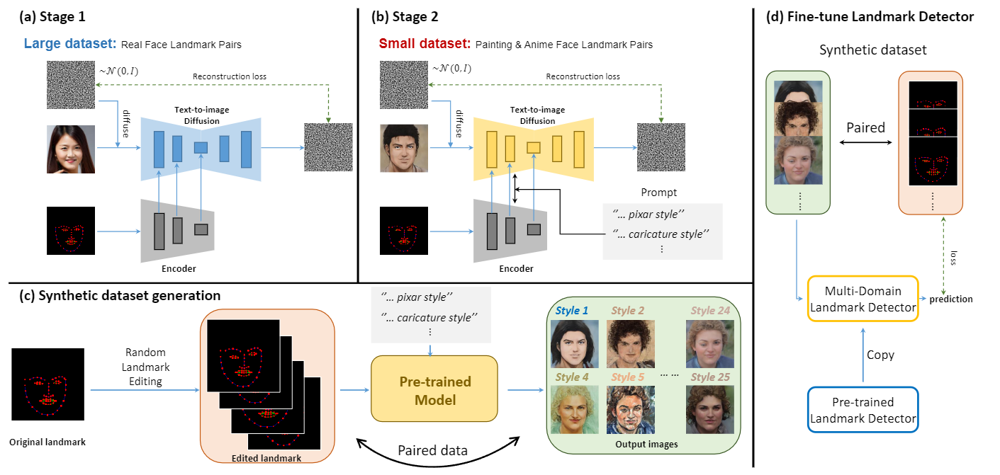

# Towards Multi-Domain Face Landmark Detection with Synthetic Data from Diffusion Model

This repository contains the synthetic dataset for our ICASSP 2024 paper titled "Towards Multi-Domain Face Landmark Detection with Synthetic Data from Diffusion Model". [](https://arxiv.org/abs/2401.13191)

## Introduction

Facial landmark detection is crucial for applications such as 3D facial reconstruction, face recognition, and augmented reality. While current methods work well for real-world images, detecting landmarks in other domains like cartoons or caricatures remains a challenge due to the lack of annotated training data.

In this work, we propose a two-stage training approach that leverages synthetic data generated by a pre-trained diffusion model to detect facial landmarks across multiple domains. Our method generates high-quality paired image-landmark datasets for various styles and fine-tunes an existing landmark detection model to achieve state-of-the-art results in multi-domain facial landmark detection.



## Installation

1. Clone the repository:
```bash
git clone https://github.com/zenonLEE/MDFLD.git
cd MDFLD
```

2. Install dependencies:
```bash
pip install -r requirements.txt
```

3. Download the pretrained model:
   - **Cartoon Dataset Model**: [Download here](https://drive.google.com/file/d/1OjZDqkt41HAqAE5mJ586KMj8BUEHC6zn/view?usp=drive_link)
   - Place the downloaded model at: `./pretrained_model/cartoon_dataset_400_v2/starv2_smoothl1/model/best_model.pkl`
   - 
## Inference Usage

### Basic Usage

```bash
python test.py [OPTIONS]
```
3. Download the pretrained model:
   - **Cartoon Dataset Model**: [Download here]([https://your-cloud-storage-link.com/best_model.pkl](https://drive.google.com/file/d/1OjZDqkt41HAqAE5mJ586KMj8BUEHC6zn/view?usp=sharing))
   - Place the downloaded model at: `./pretrained_model/cartoon_dataset_400_v2/starv2_smoothl1/model/best_model.pkl`
### Inference Modes

#### 1. Standard Testing (with annotations)
Test on dataset with ground truth annotations:
```bash
python test.py --mode=test \
               --device_ids=0 \
               --image_dir=/path/to/images \
               --annot_dir=/path/to/annotations \
               --data_definition=WFLW \
               --pretrained_weight=/path/to/model.pkl
```
#### 2. Image-Only Testing (without annotations)
Test on images without ground truth (inference only):
```bash
python test.py --mode=test_image \
               --device_ids=0 \
               --image_dir=/path/to/test/images \
               --pretrained_weight=/path/to/model.pkl \
               --data_definition=video_me_pixar_d_0.5_80
```

## Dataset
We created a large multi-domain facial landmark dataset with 25 different styles, each containing 400 images and annotations. The dataset is publicly available in this repository.
The multi-domain facial landmark dataset is available for download:
- [Download Dataset from Google Drive] [google drive link](https://drive.google.com/file/d/1taZfY8_IETJG2DkhXxv7U3JpPEokkBb4/view?usp=sharing)
### Dataset Structure:
- **Styles**: The dataset includes 25 distinct styles, each representing different visual domains.
- **Image Resolution**: The images are resized to 256x256 for consistent processing.
- **Annotations Format**: The 68 landmarks are provided as 2D coordinates (x, y) for each image, indicating the positions of important facial features..

### Example Styles:
- Caricatures
- Pixar-style characters
- Hand-drawn illustrations
- Artistic portraits
- ... ...


### Citation
If you use this dataset or find our work useful, please consider citing our paper:

```plaintext
@inproceedings{li2024towards,
  title={Towards Multi-Domain Face Landmark Detection with Synthetic Data from Diffusion Model},
  author={Li, Yuanming and Kim, Gwantae and Kwak, Jeong-gi and Ku, Bon-hwa and Ko, Hanseok},
  booktitle={ICASSP 2024-2024 IEEE International Conference on Acoustics, Speech and Signal Processing (ICASSP)},
  pages={6730--6734},
  year={2024},
  organization={IEEE}
}
